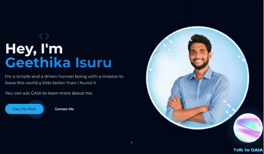

# AI Canvas Bloom - Geethika Isuru Portfolio

## You may visit: https://geethikaisuru.com 

A modern, interactive portfolio website built with React, TypeScript, and Tailwind CSS. Features a RAG-powered AI assistant (GAIA) to answer questions about Geethika.

## 🌟 Features

- **Interactive UI**: Smooth animations and transitions using Framer Motion
- **Responsive Design**: Fully responsive layout for all device sizes
- **Dark/Light Mode**: Theme switching functionality
- **Particle Background**: Dynamic, interactive particle system
- **AI Assistant (GAIA)**: RAG-based chatbot using Google Gemini API and Supabase
- **Knowledge Base**: Uploadable documents for the AI assistant to reference
- **Contact Form**: Direct messaging capability with email integration
- **Project Showcase**: Highlighting various projects with detailed descriptions
- **Professional Experience**: Timeline of work history and accomplishments
- **Certificates**: Display of professional certifications and achievements

## 🔧 Technologies

### Frontend
- React 18
- TypeScript
- Vite
- Tailwind CSS
- Framer Motion
- Shadcn UI Components
- Lucide React Icons

### Backend
- Supabase
- Supabase Edge Functions
- Google Gemini AI API
- Vector Embeddings

## 🧠 AI Features

### GAIA - Geethika's AI Assistant

GAIA is powered by a Retrieval Augmented Generation (RAG) system that:

1. Embeds user queries using the gte-small model
2. Searches for relevant documents in the Supabase vector database
3. Constructs a context-rich prompt with the retrieved information
4. Sends the prompt to Google's Gemini API to generate a response

## 👤 Author

**Geethika Isuru**

- Portfolio: [geethika-isuru.netlify.app](https://geethika-isuru.netlify.app/)
- LinkedIn: [linkedin.com/in/geethikaisuru](https://linkedin.com/in/geethikaisuru)
- GitHub: [github.com/geethikaisuru](https://github.com/geethikaisuru)
